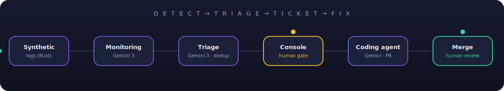
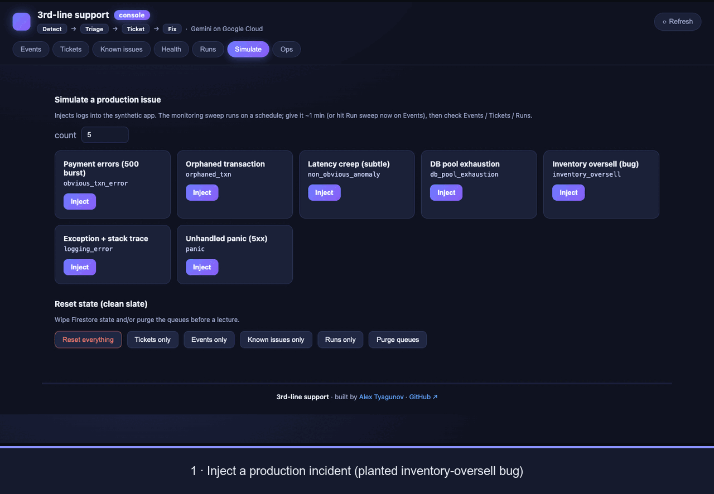

<div align="center">

# 🛰️ Agentic 3rd-Line Support

### Production issues that **detect, triage, ticket, and fix themselves** — on Google Cloud, with Gemini.
#### Humans stay in the loop for the two decisions that matter. Everything else runs itself.

<br/>

[](LICENSE)
[](https://github.com/sponsors/Alexander-Tyagunov)


</div>

<p align="center">
  
</p>

> A complete, **stand-it-up-then-`terraform destroy`** reference for an autonomous
> *3rd-line support* loop: a fake app floods realistic logs, agents detect and
> triage the problems into fully-written bug tickets, a human approves, and a
> coding agent opens the pull request — all Google-native, all in one repo.

<div align="center">

### ▶️ One real run, start to finish

</div>

<p align="center">
  
</p>

<p align="center"><sub>A planted oversell bug is injected → the <b>monitoring agent</b> detects it → the <b>triage agent</b> writes a full ticket → you approve → the console files <b>GitHub issue #8</b> → its <code>agent-bug</code> label fires a <b>GitHub Action</b> where <b>Gemini</b> writes the fix and opens <b>PR #9</b> (linked to #8, requesting your review, <b>never merged</b>) → the PR flows back into the console. A real end-to-end run, shown across both the console and GitHub.</sub></p>

---

## ✨ What this project is doing

- 🧠 **A real agent team, not a toy.** Two Gemini agents with genuine tool-use loops
  (read logs → correlate → emit findings → dedup → write tickets), plus a coding
  agent that opens PRs.
- 🔒 **Safe by construction.** Autonomy is dialed *up* where verification is cheap
  and *down* where it isn't — the system **proposes a PR, never merges**, and a
  human approves which findings become work.
- 🔁 **Idempotent triage.** The same bug is never re-filed — duplicates are recorded
  and auto-closed against a dedup registry. Nothing is silently dropped.
- 🖥️ **A console you'd actually use.** A Rust/WASM UI to watch the ledger, read the
  full bug reports, approve fixes, **simulate incidents live**, reset to a clean
  slate, and scale the fleet — all from one screen.
- ☁️ **All Google Cloud.** Cloud Run, Pub/Sub, Firestore, Cloud Logging, Vertex AI
  (Gemini), Workload Identity Federation. No keys in the cloud path. Distroless
  everywhere. Terraform up, Terraform down.

## 🔎 How the loop works

<table>
<tr>
<td width="33%" valign="top">

**1 · Detect**
Two lanes converge on a *finding*: deterministic log-based alerts for known
patterns, and a **Gemini** sweep for emergent ones (latency creep, orphaned
transactions, novel errors).

</td>
<td width="33%" valign="top">

**2 · Triage → ticket**
A **Gemini** agent grounds each finding in runbooks + a severity rubric, dedups
it, and writes a full report: description, **Gherkin** repro, expected vs current
state, the real log line, root cause, resolution, justification.

</td>
<td width="33%" valign="top">

**3 · Fix (gated)**
A human clicks **Approve & fix** → a GitHub issue → the **Gemini CLI** coding
agent implements the smallest fix + a test and **opens a PR** → a human reviews
and merges → the outcome feeds back into the dedup registry.

</td>
</tr>
</table>

## 🚦 The two human gates

|  | Gate | Why it's the human's call |
|--|------|---------------------------|
| ✅ | **Findings → tickets** | keeps noise and false positives out of the backlog |
| ✅ | **Code → production** | the only irreversible step — every fix ships as a reviewable PR |

## 📚 Documentation

Pick your lane:

### 👔 If you are a business person

The *why* and the value — plain language, no code.

- **[Business value & goals](docs/business-value.md)** — the problem agentic
  3rd-line support solves, the outcomes it drives, the guardrails that keep humans
  in control, the cost model, and what this project is (and isn't).

### 🛠️ If you are a technical person

The *how* — architecture, infrastructure, and the deep dive.

- **[Architecture](docs/architecture.md)** — the design: pipeline, data contracts,
  the agents, the two gates, idempotency, and the console.
- **[Deep-dive article](docs/article.md)** — the full end-to-end technical
  walkthrough, with the code that matters.
- **[Terraform, explained](docs/terraform.md)** — every resource and *why*
  (modules, IAM, CI/CD, and the gotchas that shaped it).
- **[Setup & exact runbook](docs/setup.md)** — stand it up on your own GCP project,
  step by step, plus the exact commands used for the reference deployment.

## 🗺️ What's in the box

| Path | What | Stack |
|------|------|-------|
| [`apps/synthetic-shop/`](apps/synthetic-shop/) | Floods business logs + a `/simulate` scenario API (with a real planted bug) | Rust · axum |
| [`agents/monitoring-agent/`](agents/monitoring-agent/) | Sweeps logs for known + emergent risks → *findings* | Python · Gemini (`google-genai`) |
| [`agents/triage-agent/`](agents/triage-agent/) | Findings → deduplicated, fully-written *tickets* | Python · Gemini |
| [`agents/coding-agent/`](agents/coding-agent/) | Approved issue → implementation → **PR** | Gemini CLI GitHub Action |
| [`ticket-system/`](ticket-system/) | Console: ledger · tickets · health · **Simulate** · **Ops**, shared types | Rust · axum + Leptos/WASM |
| [`terraform/`](terraform/) | All infra — modular, secrets isolated, WIF, DLQs | Terraform |
| [`docs/`](docs/) | [Business value](docs/business-value.md) · [Architecture](docs/architecture.md) · [Terraform](docs/terraform.md) · [Setup](docs/setup.md) · [Deep-dive article](docs/article.md) | Markdown |

## 🚀 Quickstart

```bash
# 1. Provision (see docs/setup.md for the full guide — APIs, Gemini, tokens)
cd terraform && cp terraform.tfvars.example terraform.tfvars   # fill in project + github
terraform init && terraform apply

# 2. Deploy the images (Cloud Build), then open the console URL from `terraform output`
# 3. Hit "Simulate" in the console and watch a ticket write itself
# 4. When you're done:
terraform destroy
```

Optional: turn on **per-service CI/CD** so a merge to `main` auto-builds and
redeploys only the app that changed — see [`docs/setup.md` §13](docs/setup.md#13--continuous-deployment-cloud-build).

Full, copy-pasteable instructions: **[`docs/setup.md`](docs/setup.md)**.

## 🛡️ Cost & safety

Everything scales to zero except the log generator; a budget alert guards spend;
`terraform destroy` removes it all. Least-privilege service account per workload,
Gemini via Workload Identity Federation (no keys), authenticated Pub/Sub push with
dead-letter queues, and only synthetic data in the logs.

---

<div align="center">

**Built to be understood, run, and torn down.** If it helped you think about
agentic operations, **give it a ⭐**.

If this reference saved you time, consider **[❤ sponsoring](https://github.com/sponsors/Alexander-Tyagunov)** — it funds more open, end-to-end builds like this.

<sub>MIT licensed · a full-GCP, Gemini-powered reference implementation</sub>

</div>
