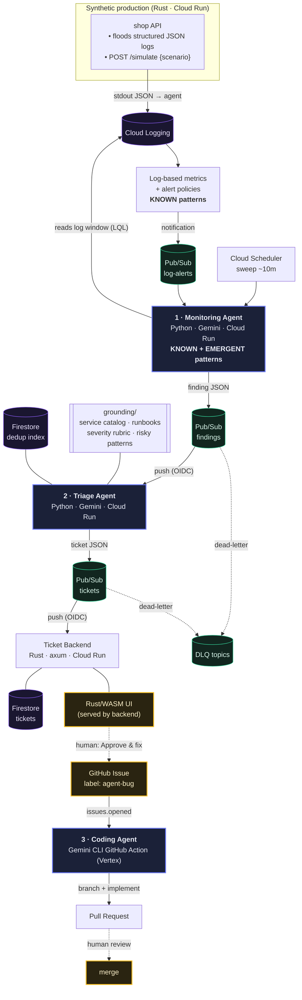

# Architecture

<samp>[Business value](business-value.md) &nbsp;·&nbsp; **Architecture** &nbsp;·&nbsp; [Setup](setup.md) &nbsp;·&nbsp; [Terraform](terraform.md) &nbsp;·&nbsp; [Deep-dive](article.md) &nbsp;·&nbsp; [↩ README](../README.md)</samp>

> The source of truth for the design. Written to double as the backbone of the
> lecture and the deep-technical article.

<details open>
<summary><b>Contents</b></summary>

1. [Problem framing](#1-problem-framing)
2. [The pipeline](#2-the-pipeline)
3. [Data contracts](#3-data-contracts)
4. [Where the human gates are](#4-where-the-human-gates-are)
5. [GCP service mapping](#5-gcp-service-mapping)
6. [The agents in detail](#6-the-agents-in-detail)
7. [The synthetic app](#7-the-synthetic-app)
8. [Grounding](#8-grounding)
9. [Cost & teardown](#9-cost--teardown)
10. [Security notes](#10-security-notes)
11. [Idempotency & the event ledger](#11-idempotency--the-event-ledger)
12. [Management console & health](#12-management-console--health)

</details>

---

## 1. Problem framing

Traditional support tiers escalate a problem until it reaches the engineers who
can change the code. That final tier — **3rd line** — does four things:

| # | Step | What it produces |
|---|------|------------------|
| 1 | **Detect** | a signal that something is wrong in production (logs/metrics) |
| 2 | **Triage** | a concrete, deduplicated, actionable defect |
| 3 | **File** | a ticket with enough grounding for someone to act |
| 4 | **Fix** | a code change, proposed for review |

Each step is a good fit for an agent, and the seams between them are natural
message boundaries. This project builds the loop as **cooperating agents joined
by queues**, with humans gating the two irreversible-ish decisions.

---

## 2. The pipeline



### Two deliberate detection lanes

| Lane | Mechanism | Cost | Catches |
|------|-----------|------|---------|
| **Deterministic** (known) | Cloud Logging log-based metrics + alert policies | Instant, **no LLM cost** | patterns you can name in advance — payment error rate, 5xx spikes |
| **Agentic** (emergent) | Monitoring Agent sweeps a log window with Gemini | Model cost, on a schedule | clusters no rule covers — latency creep, new error signatures, *orphaned transactions* |

Both lanes converge on the same output: a **finding**.

---

## 3. Data contracts

> [!NOTE]
> Keeping the messages small and typed is what makes the stages swappable — any
> stage can be reimplemented as long as it honours the contract.

### `finding` — Monitoring Agent → `findings` topic

```json
{
  "finding_id": "fnd_2026-07-18T10:32:00Z_ab12",
  "detected_at": "2026-07-18T10:32:00Z",
  "source_lane": "agentic | deterministic",
  "service": "checkout",
  "severity": "WARNING | ERROR | CRITICAL",
  "title": "Payments captured without matching order creation",
  "summary": "12 payment.captured events in 5m have no order.created within 60s.",
  "signature": "orphaned_txn:checkout:payment.captured",
  "evidence": {
    "log_query": "resource.type=\"cloud_run_revision\" jsonPayload.event=\"payment.captured\" ...",
    "sample_trace_ids": ["projects/.../traces/06796866..."],
    "count": 12,
    "window": "2026-07-18T10:27:00Z/2026-07-18T10:32:00Z"
  }
}
```

`signature` is the stable dedup key. `source_lane` records which detector fired.

### `ticket` — Triage Agent → `tickets` topic

```json
{
  "ticket_id": "tkt_00042",
  "created_at": "2026-07-18T10:33:10Z",
  "finding_ids": ["fnd_2026-07-18T10:32:00Z_ab12"],
  "status": "proposed",
  "severity": "S2",
  "service": "checkout",
  "title": "Orphaned transactions: payment captured, order never created",
  "root_cause_hypothesis": "Order write happens after payment capture with no compensation on failure.",
  "suggested_fix": "Wrap capture+order-create in a saga / outbox; add retry + alert.",
  "grounding_refs": ["grounding/runbooks.md#payments", "grounding/service-catalog.md#checkout"],
  "evidence": { "...": "carried from finding(s)" },
  "dedup": { "signature": "orphaned_txn:checkout:payment.captured", "is_duplicate": false }
}
```

### Ticket → coding agent bridge

When a human clicks **Approve & fix** in the UI (or in `auto_approve` demo mode),
the Ticket Backend creates a **GitHub Issue** labeled `agent-bug` whose body is a
rendered version of the ticket. The `issues.opened` event triggers the coding
agent.

---

## 4. Where the human gates are

| Gate | Where | Why |
|------|-------|-----|
| **Findings → tickets** | Triage Agent proposes; UI shows `proposed` tickets; human approves | Prevents noisy/false findings from becoming work |
| **Code → production** | PR review before merge | The only irreversible step; never automated |

> [!IMPORTANT]
> Everything before a gate is *reversible and cheap*, so the agents run
> autonomously there. **Dial autonomy up where verification is cheap, down where
> it isn't** — the principle the whole design turns on.

---

## 5. GCP service mapping

| Concern | Service |
|---------|---------|
| Compute (app + agents + ticket backend) | **Cloud Run** (v2 services, scale-to-zero except the app) |
| Log ingestion & query | **Cloud Logging** (structured `jsonPayload`, LQL) |
| Known-pattern detection | **Log-based metrics** + **Monitoring alert policies** |
| Message backbone | **Pub/Sub** (topics + push subscriptions + dead-letter) |
| Scheduled sweep | **Cloud Scheduler** |
| Ticket & dedup state | **Firestore** (Native mode) |
| Model access | **Vertex AI** (Gemini models, v3+; SA + Workload Identity Federation) |
| Secrets | **Secret Manager** (GitHub token; no model API key needed with Vertex) |
| Images | **Artifact Registry** |
| Deploy from GitHub | **Cloud Build** 2nd-gen connection (or GitHub Actions + WIF) |
| Cost guard | **Cloud Billing budget** alert |

---

## 6. The agents in detail

### 1 · Monitoring Agent — *producer*

- **Triggers** — Cloud Scheduler (periodic sweep) + `log-alerts` push (enrich a
  known alert with context).
- **Tools** — Cloud Logging read (LQL), a small set of query templates from
  `grounding/risky-patterns.md`.
- **Job** — classify what's happening in the window, decide if it is
  finding-worthy, emit `finding` JSON to `findings`.
- **Pattern** — mostly *routing* + *evaluator*: cheap classification first, deep
  reasoning only on candidates.

### 2 · Triage Agent — *subscriber → producer*

- **Trigger** — Pub/Sub push (OIDC) on `findings`.
- **Grounding** — reads `grounding/` (service catalog, runbooks, severity rubric)
  and the Firestore **dedup index** keyed on `signature`.
- **Job** — record a ledger event for *every* finding (nothing is silently
  dropped): if the `signature` is new and actionable, create a ticket and register
  the known issue; if it duplicates a registered issue, record `duplicate_closed`
  (a valid event, closed with no action); if it's noise, record `ignored`.
- **Tools** — `find_duplicate`, `create_ticket`, `close_as_duplicate`,
  `ignore_finding` (Firestore + Pub/Sub backed).
- **Pattern** — routing + a programmatic idempotency gate; see [§11](#11-idempotency--the-event-ledger).

### 3 · Coding Agent — *subscriber → producer*

- **Primary** — the **Gemini CLI GitHub Action** on `issues.opened` (`agent-bug`),
  authenticated to **Vertex** via Workload Identity Federation. Implements the fix
  on a branch and opens a PR that references the ticket + evidence.
- **Taught alternative** — a **Cloud Run Job** running the **Gemini SDK
  (google-genai)** that subscribes to `tickets` directly, clones the repo,
  implements, and opens the PR with `gh` — closing the loop entirely inside GCP.
  Documented so the lecture can contrast "use the product" vs "build the harness."

---

## 7. The synthetic app

A fake e-commerce service that makes the demo legible:

- **Baseline flood** — a background task continuously emits business-meaningful
  structured logs (`browse`, `add_to_cart`, `checkout`, `payment.captured`,
  `order.created`, `auth`) at a configurable rate, so logs always flow.
- **On-demand scenarios** — `POST /simulate {"scenario": "...", "count": N}`
  injects a specific failure so you can drive the demo live:

| Scenario | What it emits | Which lane should catch it |
|----------|---------------|----------------------------|
| `obvious_txn_error` | burst of `payment.failed` / HTTP 500 | deterministic alert |
| `logging_error` | exception + stack trace on `message` | deterministic/agentic |
| `orphaned_txn` | `payment.captured` with no `order.created` | agentic (correlation) |
| `non_obvious_anomaly` | latency creep / elevated retry rate | agentic only |
| `db_pool_exhaustion` | connection-pool errors | deterministic |
| `inventory_oversell` | sells beyond stock (the planted **code bug**) | agentic → coding agent |
| `panic` | rare unhandled 5xx spike | deterministic |

See [`apps/synthetic-shop/README.md`](../apps/synthetic-shop/README.md).

---

## 8. Grounding

The triage agent is only as good as what it can reason over. `grounding/` holds
versioned, reviewable Markdown:

- **service catalog** — services, owners, dependencies, SLOs.
- **runbooks** — known failure modes and how to think about them.
- **severity rubric** — the S1–S4 mapping used to score tickets.
- **risky-patterns** — named patterns + the LQL that surfaces them.

> [!TIP]
> Because grounding is in-repo Markdown, changes are diffable and reviewable like
> code — invest here before tuning prompts.

---

## 9. Cost & teardown

| Component | Min instances | Steady cost |
|-----------|:-------------:|-------------|
| Agents, triage, ticket backend | **0** (scale to zero) | none when idle |
| Synthetic app | **1**, CPU always on | the only steady cost |

A cheaper alternative to a warm synthetic app (Cloud Scheduler pinging an endpoint
each minute) is documented for the cost-sensitive. A **billing budget alert** is
created by Terraform.

> [!NOTE]
> `terraform destroy` removes everything. This is an ephemeral, educational
> deployment by design.

---

## 10. Security notes

- Least-privilege **one service account per service**.
- **Vertex** access via Workload Identity Federation — no downloadable keys.
- Pub/Sub push uses **OIDC**; each subscription can only invoke its one target.
- The GitHub token (for issue creation) is the only app secret, in Secret Manager.
- No PII/secrets in logs — the synthetic app emits only synthetic data.

---

## 11. Idempotency & the event ledger

Every finding the triage agent processes produces a **ledger event** — the system
never silently discards a signal. Three outcomes:

| Outcome | When | Effect |
|---------|------|--------|
| **`ticketed`** | new and actionable | a ticket is created and its `signature` registered in `known_issues` |
| **`duplicate_closed`** | a matching `signature` is already registered | recorded as a valid event, **closed with no action**, occurrence count incremented |
| **`ignored`** | not actionable (noise) | recorded with a reason |

`duplicate_closed` is what stops the agent re-filing the same bug from the same
recurring logs.

`known_issues/{signature}` is the registry: canonical ticket id, `status`
(`open` / `merged` / `declined` / `wontfix`), first/last seen, occurrence count.

**Ticket lifecycle:**

```
proposed → approved → issue_created → pr_opened → (merged | declined)
                                                    └── plus duplicate_closed
```

Every team decision (approve, decline, merge) is captured, giving a full audit
trail.

---

## 12. Management console & health

A single **console** (the `ticket-system/` app) is the one pane of glass over the
whole loop, with six tabs:

- **Events** — the ledger: what was monitored, ticketed, deduped/closed, or
  ignored. **Filterable** by outcome (All / Ticketed / Duplicates / Ignored, with
  live counts), and each `duplicate_closed` row **links to the ticket it repeats**
  plus the agent's reason for calling it a duplicate.
- **Tickets & history** — raised bugs and their full report. The action cell is
  **lifecycle-aware**: `proposed` shows **Approve & fix** (the human gate from
  [§4](#4-where-the-human-gates-are)); once approved it becomes an **agent-working**
  badge + a link to the GitHub issue; when the coding agent opens a PR it shows
  **both** the issue and PR links; then `merged` / `declined`. Approve is only
  offered while `proposed` (and is idempotent server-side) so a double-click can't
  file two issues.
- **Known issues** — the dedup registry with each signature's status + occurrence
  count.
- **Health** — liveness of the synthetic app and each agent, from heartbeats
  written to `health/{component}` on each run (Cloud Monitoring uptime checks are
  the production-grade alternative).
- **Runs** — every monitoring sweep and triage invocation (Firestore `runs`):
  **success/fail**, trigger (scheduler / manual / alert / pubsub), when, a one-line
  summary or the error, and a deep link to the full **Cloud Logging** for that
  service. Events also shows the monitoring agent's last-run + status inline.
- **Simulate** — inject any scenario and reset state (scoped, incl. `runs`) for a
  clean demo.
- **Ops** — Cloud Run status + scale each service; the console's own service is
  flagged, and the tab explains that scaling to 0 removes the warm floor but does
  not switch a service off.

**Visibility & restart at every step.** Each step reports state and can be
re-run: **monitoring** — last-run/status on Events + a **Run sweep now** button
(the console OIDC-invokes `/sweep`); **triage** — per-finding run records (re-runs
automatically on the next finding); **coding** — the ticket's lifecycle
(`issue_created → pr_opened → merged/declined`) plus a link to the GitHub Actions
runs and a **Retry** button that re-fires the `agent-bug` label to restart the fix
after a transient failure. Every timestamp in the console is shown in **Eastern
time (America/New_York)**.

Every page carries a footer linking back to the source repository.

> [!NOTE]
> **Feedback loop.** A GitHub webhook updates the ticket lifecycle **and** the
> `known_issues` status: `pull_request` *opened* sets `pr_opened` and records the
> PR URL on the ticket (so the console shows the live issue **and** PR links);
> *closed/merged* (or an issue closed directly) resolves it to `merged` /
> `declined`. A merged fix or a declined/won't-fix decision therefore changes how
> the next matching finding is treated.

**Firestore collections:** `known_issues`, `tickets`, `events` (ledger), `health`,
`runs` (agent run history).
