# Building agentic 3rd-line support on GCP

<samp>[Business value](business-value.md) &nbsp;·&nbsp; [Architecture](architecture.md) &nbsp;·&nbsp; [Setup](setup.md) &nbsp;·&nbsp; [Terraform](terraform.md) &nbsp;·&nbsp; **Deep-dive** &nbsp;·&nbsp; [↩ README](../README.md)</samp>

> An end-to-end reference for a production-support loop that detects issues,
> triages them into tickets, and proposes code fixes — with humans gating the
> decisions that matter. Every component in this article is in the companion
> repository and compiles.

<details open>
<summary><b>Contents</b></summary>

1. [What "3rd-line support" actually means](#1-what-3rd-line-support-actually-means)
2. [Principles before architecture](#2-principles-before-architecture)
3. [Two detection lanes, on purpose](#3-two-detection-lanes-on-purpose)
4. [Structured logs are the contract with the platform](#4-structured-logs-are-the-contract-with-the-platform)
5. [The monitoring agent: a real tool-using agent](#5-the-monitoring-agent-a-real-tool-using-agent)
6. [Triage and idempotency: never file the same bug twice](#6-triage-and-idempotency-never-file-the-same-bug-twice)
7. [The console: one pane of glass, in Rust](#7-the-console-one-pane-of-glass-in-rust)
8. [The coding agent: propose, never push](#8-the-coding-agent-propose-never-push)
9. [Closing the loop](#9-closing-the-loop)
10. [Infrastructure and security](#10-infrastructure-and-security)
11. [Safety and failure modes](#11-safety-and-failure-modes)
12. [What I'd watch, and where to take it](#12-what-id-watch-and-where-to-take-it)

</details>

---

## 1. What "3rd-line support" actually means

Support escalates until it reaches the people who can change the code:

| Tier | Role |
|------|------|
| **1st line** | helpdesk / triage |
| **2nd line** | operations |
| **3rd line** | the *engineering* escalation tier that reads production signals and fixes root causes **in code** |

That third tier does four things: **detect** a problem, **triage** it into a
concrete defect, **file** a ticket with enough grounding to act, and **fix** it in
code. Each step is a natural fit for an agent, and the seams between them are
message boundaries. This project builds that loop as cooperating agents joined by
queues:

```mermaid
flowchart LR
  SHOP["synthetic-shop"] --> CL["Cloud Logging"] --> MON["monitoring agent"]
  MON --> F(["findings"]) --> TRI["triage agent"] --> T(["tickets"])
  T --> CON["console<br/>+ human gate"] --> ISS["GitHub Issue"]
  ISS --> COD["coding agent"] --> PR["Pull Request"]
  PR --> MRG["human merge"] --> WH["webhook"]
  WH -.->|"lifecycle + dedup registry"| TRI

  classDef agent fill:#1b2138,stroke:#6d7cff,stroke-width:2px,color:#e7eaf6;
  classDef queue fill:#12261f,stroke:#34d399,color:#d7f5e9;
  classDef gate fill:#2a2411,stroke:#fbbf24,stroke-width:2px,color:#fdf0c9;
  class MON,TRI,COD agent;
  class F,T queue;
  class CON,MRG gate;
```



> [!IMPORTANT]
> The point is not to remove humans. It is to **move the human to the two
> decisions that carry real risk** — which findings become work, and which code
> ships — and let the agents run autonomously everywhere the work is cheap and
> reversible.

---

## 2. Principles before architecture

Three ideas from Anthropic's *Building Effective Agents* shaped every choice:

1. **Keep it simple.** Don't build an agent where a single call or a bit of
   deterministic code will do. Add complexity only when it demonstrably helps.
2. **Transparency.** Show the agent's steps; make its decisions inspectable. The
   event ledger (below) exists for exactly this.
3. **The agent–computer interface matters.** Small, well-documented tool surfaces
   beat sprawling ones. Each agent here has two to four tools.

> [!TIP]
> And one operational rule everything hinges on: **gate at decisions, not at every
> step.** Dial autonomy *up* where verification is cheap and rollback is real
> (detection, triage drafts), *down* where it isn't (shipping code). That is why
> the system proposes a **pull request** and never merges on its own.

---

## 3. Two detection lanes, on purpose

A common mistake is to make the LLM do everything, including things a filter does
better. This design uses **two lanes** that converge on one output, a *finding*:

- **Deterministic lane.** Cloud Logging **log-based metrics** + **alert policies**
  catch patterns we can name in advance — a payment-error spike, a 5xx burst.
  Instant, cheap, **no model cost**. They publish to a Pub/Sub topic.
- **Agentic lane.** A **monitoring agent** runs on a schedule, pulls a window of
  logs, and reasons about *emergent* patterns no predefined rule covers: latency
  creep, a novel error signature, or a correlation violation like an orphaned
  transaction. This is where the model earns its cost.

The synthetic app makes this legible. It floods realistic structured logs and
exposes one endpoint to inject failures on demand:

```
POST /simulate {"scenario": "orphaned_txn", "count": 10}
```

Scenarios include `obvious_txn_error` (deterministic alert catches it),
`non_obvious_anomaly` (only the agentic sweep does), and `inventory_oversell` —
a **real planted bug** the coding agent later fixes.

---

## 4. Structured logs are the contract with the platform

Cloud Logging promotes specific JSON fields (`severity`, `message`,
`logging.googleapis.com/trace`, `.../labels`). The synthetic app emits one JSON
object per line to stdout, and — because emitting those logs *is its whole job* —
it writes them directly rather than through a logging framework:

```rust
// apps/synthetic-shop/src/events.rs — one event, Cloud Logging shape
let mut obj = json!({
    "severity": severity,
    "message": message,
    "event": event,                 // stays in jsonPayload → queryable
    "service": svc,
    "logging.googleapis.com/trace": format!("projects/{}/traces/{}", project_id(), trace_id),
    "logging.googleapis.com/labels": { "service": svc, "request_id": request_id, "event": event },
});
```

> [!NOTE]
> The trace id is the trick that makes correlation possible. A correct purchase
> emits `checkout → payment.captured → order.created` **sharing one trace**; an
> orphaned transaction is a `payment.captured` with no `order.created` on the same
> trace. The agent detects it by *following the trace*, not by pattern-matching a
> single line.

---

## 5. The monitoring agent: a real tool-using agent

Built on the Vertex **Gemini** SDK (`google-genai`) with a deliberately tiny
interface — one read tool, one write tool, declared as function declarations:

```python
# agents/monitoring-agent/app/tools.py
QUERY_LOGS = types.FunctionDeclaration(
    name="query_logs",
    description="Run a Cloud Logging (LQL) filter over a recent window ...",
    parameters_json_schema={"type": "object",
        "properties": {"filter": {"type": "string"}, "minutes": {"type": "integer"}},
        "required": ["filter"]},
)
EMIT_FINDING = types.FunctionDeclaration(name="emit_finding", description="...",
    parameters_json_schema=EMIT_SCHEMA)  # publishes to the findings topic
```

The loop calls `generate_content` with those tools, reads
`candidate.content.parts[].function_call`, dispatches to the plain-Python tool
bodies, and feeds each result back as a `function_response` part until the model
stops calling tools. It authenticates to Gemini through **Vertex AI**
(`genai.Client(vertexai=True, ...)` + ADC — no API key), disables "thinking"
(`ThinkingConfig(thinking_budget=0)`, or the model can return an empty candidate),
and is bounded by a turn cap. Its system prompt embeds the grounding
(`grounding/risky-patterns.md`) and instructs it to sweep, correlate, deduplicate
by a stable `signature`, and emit only actionable findings. The output is a small,
typed message:

```json
{ "finding_id": "...", "source_lane": "agentic", "service": "checkout",
  "severity": "ERROR", "signature": "orphaned_txn:checkout:payment.captured",
  "title": "...", "summary": "...", "evidence": { "log_query": "...", "count": 12 } }
```

Small typed messages are what make the stages swappable.

---

## 6. Triage and idempotency: never file the same bug twice

The triage agent consumes findings (Pub/Sub push, OIDC-authenticated), reasons
over the grounding (service catalog, runbooks, severity rubric), and resolves each
finding into **exactly one ledger event** — nothing is silently dropped:

| Outcome | When | Effect |
|---------|------|--------|
| **`ticketed`** | new and actionable | publish a ticket, register the signature |
| **`duplicate_closed`** | a matching signature is already registered | recorded as a valid event and closed with no action, occurrence count incremented |
| **`ignored`** | noise | recorded with a reason |

The tool surface encodes the policy directly: `find_duplicate`, `create_ticket`,
`close_as_duplicate`, `ignore_finding`. The dedup key lives in
`known_issues/{signature}` in Firestore, alongside its lifecycle status.

> [!IMPORTANT]
> This is the mechanism that stops an agent re-opening the same bug every time the
> same recurring log reappears — the thing that makes autonomous triage safe to
> run continuously.

---

## 7. The console: one pane of glass, in Rust

Detection and triage are invisible unless you can see what they did. The console
is a Rust service that is both the **ticket system** and the **observability
plane**:

- **Backbone** — Pub/Sub topics for `log-alerts → findings → tickets`, each with an
  authenticated **push** subscription into a scale-to-zero Cloud Run service, plus
  dead-letter topics.
- **State** — Firestore collections `known_issues`, `tickets`, `events` (the
  ledger), `health`.
- **Backend** — `axum`, talking to Firestore over the **REST API** (`reqwest` + a
  metadata-server bearer token). No third-party Firestore client — the auth and the
  typed-value marshalling are visible in `firestore.rs`, which is the point in a
  teaching repo.
- **Frontend** — **Leptos compiled to WASM**, served as a static bundle by the
  backend. Backend and UI share one `ticket-shared` crate, so the wire types are
  *identical* on both sides and cannot drift — the concrete payoff of keeping the
  console in Rust.

```rust
// ticket-system/shared/src/lib.rs — compiled into both the axum backend and the WASM UI
pub struct Ticket { pub ticket_id: String, pub status: String, pub severity: String,
                    pub service: String, pub title: String, pub signature: String, /* ... */ }
```

The UI has views for **Events** (the ledger — filterable by outcome, with each
duplicate linking back to the ticket it repeats), **Tickets & history**, **Known
issues**, **Health**, **Runs**, **Simulate**, and **Ops**; every timestamp is
rendered in the operator's Eastern time. The ticket action cell is
**lifecycle-aware**: it offers **Approve & fix** — the first human gate — only
while a ticket is `proposed`; approving opens a GitHub Issue labeled `agent-bug`
and the cell becomes an *agent-working* badge with a link to the issue, then gains
a link to the pull request once the coding agent opens one. Approve is idempotent
server-side, so a stray double-click cannot file two issues.

Because an autonomous loop is only trustworthy if you can *see* and *restart* each
step, the console makes every step observable and re-runnable. The **Runs** view
records each monitoring sweep and triage invocation to a Firestore `runs`
collection — success/fail, trigger, timing, a summary or the error, and a deep
link to that service's Cloud Logging. Detection can be re-run on demand (**Run
sweep now**, which OIDC-invokes the agent's `/sweep`), and the coding step can be
restarted per issue (**Retry**, which re-fires the `agent-bug` label so the GitHub
Action runs again) — so a fix that failed on a transient outage is one click from
a retry, not a manual redeploy.

---

## 8. The coding agent: propose, never push

The issue triggers the third agent. There are two ways to build it, and the repo
documents both:

- **Path A (primary) — the Gemini CLI GitHub Action.** Triggered by the `agent-bug`
  issue, it authenticates to Gemini via **Vertex + Workload Identity Federation**
  (no keys), reads `GEMINI.md`/`CLAUDE.md`, implements the smallest fix, adds a
  regression test, runs checks, and **opens a PR**. Cost and loops are bounded by
  `concurrency`, `timeout-minutes`, and the CLI's turn limits.
- **Path B (taught alternative) — a self-hosted Gemini (`google-genai`) Cloud Run
  Job** that subscribes to the `tickets` topic directly, drives file/command tools
  to implement, and runs `gh pr create` — closing the loop entirely inside GCP.

> [!NOTE]
> The demo target is real: `apps/synthetic-shop/src/inventory.rs` has a planted
> `reserve()` that decrements stock *before* checking availability, so it can go
> negative. The correct fix — check-before-decrement, return `Insufficient`, add a
> test — is exactly what the agent is asked to produce. The **second human gate**
> is the PR review.

---

## 9. Closing the loop

When the coding agent opens the PR, GitHub calls the backend's `/webhook/github`
(HMAC-verified); the backend reads the "Fixes #N" reference, maps it to the ticket,
sets `pr_opened`, and records the PR URL — which is how the console shows the live
issue **and** PR links side by side. When the PR merges (closing the issue) or the
team declines it, the same endpoint updates both the **ticket lifecycle** and the
**`known_issues` status** (`merged` / `declined`) and appends a ledger event:

```rust
// ticket-system/backend/src/webhook.rs
let (ticket_status, ki_status, outcome) = match reason {
    "not_planned" => ("declined", "declined", "pr_declined"),
    _             => ("merged",   "merged",   "pr_merged"),   // completed → fixed
};
```

That status feeds back into triage's next decision: a *merged* fix that recurs is
a regression worth a new ticket; a *declined* one stays auto-closed as a
duplicate. **The loop learns from the team's decisions.**

---

## 10. Infrastructure and security

Terraform is split by concern — `apis`, `iam`, `secrets`, `logging`, `pubsub`,
`cloud_run`, `scheduler`, `workload_identity`, `cloudbuild`, `monitoring` — with a
reusable `agent-service` module (Cloud Run service + dedicated SA + invoker IAM).
The security posture:

- **One least-privilege service account per workload** — the monitoring agent can
  read logs and call Vertex; it cannot write tickets.
- **No model keys in the cloud path** — Vertex via Workload Identity Federation.
- **Secrets isolated** — Terraform creates Secret Manager *containers* and IAM; the
  values are injected out-of-band (`TF_VAR_github_token`) and never committed.
- **Authenticated Pub/Sub push** (OIDC), each subscription able to invoke only its
  one target, with dead-letter topics.

Everything scales to zero except the log flooder, a budget alert guards spend, and
`terraform destroy` removes it all — an ephemeral, educational deployment by
design.

---

## 11. Safety and failure modes

| Failure mode | Mitigation |
|--------------|------------|
| **Hallucinated findings** | the dedup registry plus the human approval gate stop noise from becoming work; the ledger records what was suppressed and why |
| **Runaway loops** | `max_turns`, workflow `timeout-minutes`, and per-issue `concurrency` bound cost; the webhook filters bot comments |
| **Bad code** | never auto-merged; a human reviews every PR |
| **Data hygiene** | the synthetic app emits only synthetic data; no PII in logs |

---

## 12. What I'd watch, and where to take it

- **Grounding quality is the ceiling** on triage. It lives as versioned Markdown so
  it's reviewed like code — invest there before tuning prompts.
- **Correlation is expensive** — bound the windows and sample traces rather than
  scanning everything.
- **Natural extensions** — SLO-burn-rate detection, a confidence score on findings
  that routes low-confidence ones to a cheaper model, and grouping related tickets
  into incidents.

---

The full, runnable implementation — Terraform, the Rust services, the Python
agents, and the setup guide — is in the repository. Stand it up, run the demo,
and `terraform destroy` when you're done.
